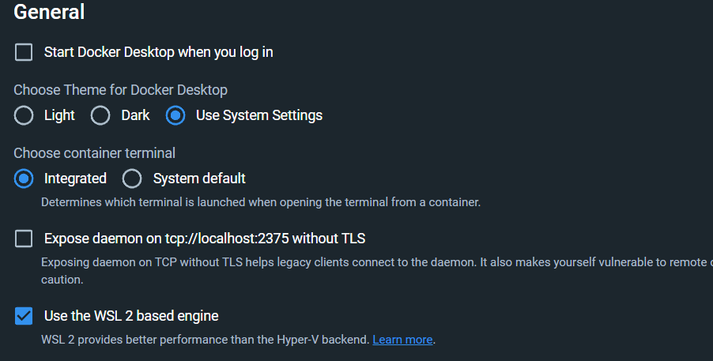
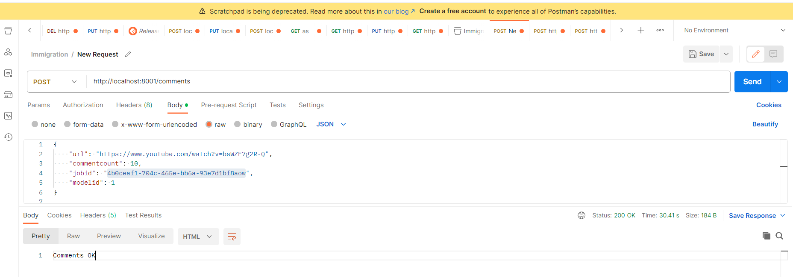
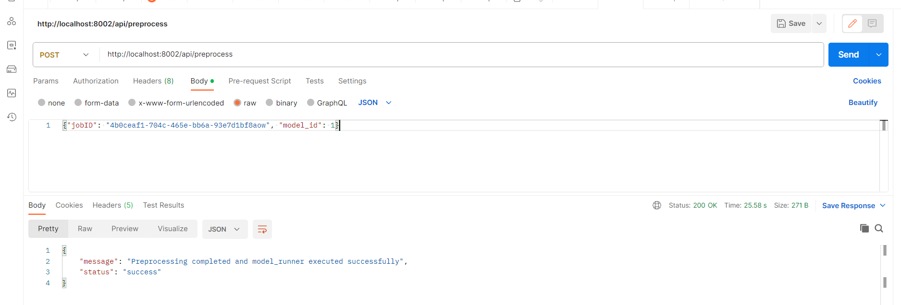
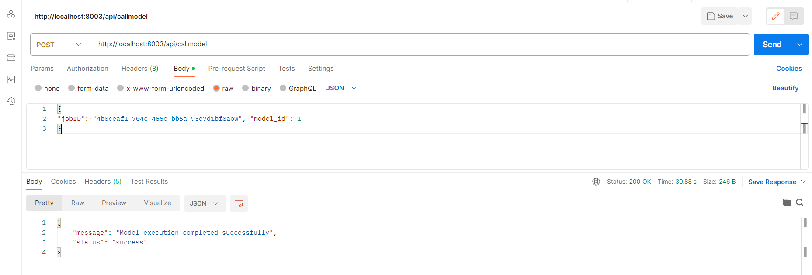

# Irish-Immigrations-Study-with-ML

## Running Backend Services Using Docker in VSCode (Windows User)

### Requirements:
1. Install WSL extension in VSCode and then open the project in 
wsl mode(Short cut : CTRL+SHIFT+P)

2. Verify the docker is using wsl and is enabled in settings

### Commands:
Open the terminal for root folder (Irish-Immigrations-Study-with-ML) in VSCode and type the following commands

1. docker-compose build
2. docker-compose up

### Sending Requests:
1. Sample postman Request for Data Service:

Url : http://localhost:8001/comments

Sample Request JSON: {
    "url": "https://www.youtube.com/watch?v=bsWZF7g2R-Q",
    "commentcount": 10,
    "jobid": "4b0ceaf1-704c-465e-bb6a-93e7d1bf8aow",
    "modelid": 1
}
2. Preprocessing Service:

Url : http://localhost:8002/api/preprocess

Sample Request JSON: {
    "jobID": "4b0ceaf1-704c-465e-bb6a-93e7d1bf8aow", "model_id": 1
}

3. NLP Service:

Url: http://localhost:8003/api/callmodel

Sample Request JSON: {
    "jobID": "4b0ceaf1-704c-465e-bb6a-93e7d1bf8aow", "model_id": 1
}

## Running Backend Services Without Docker  (Windows User):

### Note: Changes Done in this section are for local testing and should not be merged with main branch.

Stop all the containers if running because they are all mapped to 
their respective ports in the localhost. Then before running the services locally
please change the container name to localhost in the URLs used in code 
to call the other services.

For example the  YTComment.py the hostname in post call to preprocessing_script must be changed. e.g. preprocess_url = 'http://localhost:5002/api/preprocess' .
Perform these changes in urls used for calls in other services as well.